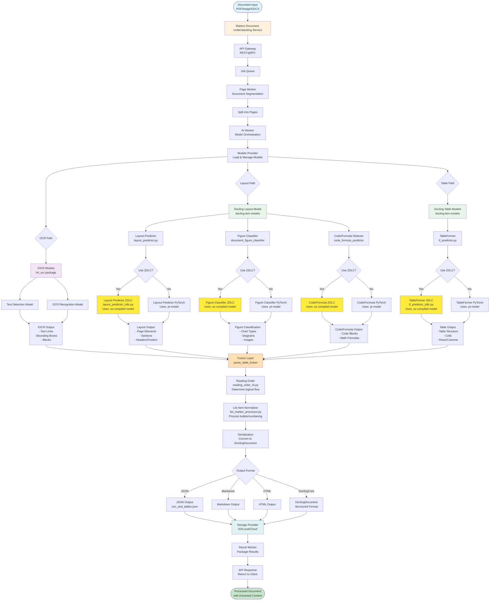

# Watson Document Understanding - End-to-End Document Processing Flow

## Mermaid Diagram

## Component Details

### 1. **Input Layer**
- Accepts: PDF, Images (PNG, JPG), DOCX
- Entry point: REST API or gRPC endpoint

### 2. **WDU Service Layer**
- **API Gateway**: Routes requests to appropriate workers
- **Job Queue**: Manages processing queue
- **Page Worker**: Splits documents into pages

### 3. **AI Worker & Model Provider**
- **AI Worker**: Orchestrates model execution
- **Models Provider**: Manages model loading and lifecycle
- Supports both PyTorch and ZDLC backends

### 4. **IOCR Processing** (hrl_ocr package)
- **Text Detection**: Locates text regions
- **OCR Recognition**: Extracts text content
- **Output**: Text lines, bounding boxes, blocks

### 5. **Docling Models Processing** (docling-ibm-models)

#### Layout Analysis
- **Model**: Layout Predictor
- **Backends**: PyTorch (.pt) or ZDLC (.so)
- **Output**: Page structure, sections, headers

#### Table Extraction
- **Model**: TableFormer
- **Backends**: PyTorch (.pt) or ZDLC (.so)
- **Output**: Table structure, cells, rows/columns

#### Figure Classification
- **Model**: Document Figure Classifier
- **Backends**: PyTorch (.pt) or ZDLC (.so)
- **Output**: Chart types, diagrams, image classification

#### Code/Formula Detection
- **Model**: Code Formula Predictor
- **Backends**: PyTorch (.pt) or ZDLC (.so)
- **Output**: Code blocks, mathematical formulas

### 6. **Post-Processing**
- **Fusion Layer**: Combines IOCR + Docling outputs
- **Reading Order**: Determines logical document flow
- **List Normalizer**: Processes bullets and numbering

### 7. **Serialization & Output**
- **Formats**: JSON, Markdown, HTML, DoclingDocument
- **Storage**: S3, Local filesystem, Cloud storage
- **Response**: Packaged results returned to client

## ZDLC Integration Points

The ZDLC predictors you created integrate at these decision points:

1. **Layout Predictor**: `layout_predictor_zdlc.py`
2. **TableFormer**: `tf_predictor_zdlc.py`
3. **Figure Classifier**: `document_figure_classifier_predictor_zdlc.py`
4. **Code/Formula**: `code_formula_predictor_zdlc.py`

Each ZDLC predictor:
- Uses compiled `.so` models instead of `.pt` PyTorch models
- Provides same API interface as PyTorch version
- Offers faster inference on IBM Z systems
- Maintains identical output data types

## Performance Benefits with ZDLC

- **Faster Inference**: 2-5x speedup on IBM Z
- **Lower Memory**: Optimized memory usage
- **Better CPU Utilization**: Leverages Z architecture
- **Production Ready**: Drop-in replacement for PyTorch