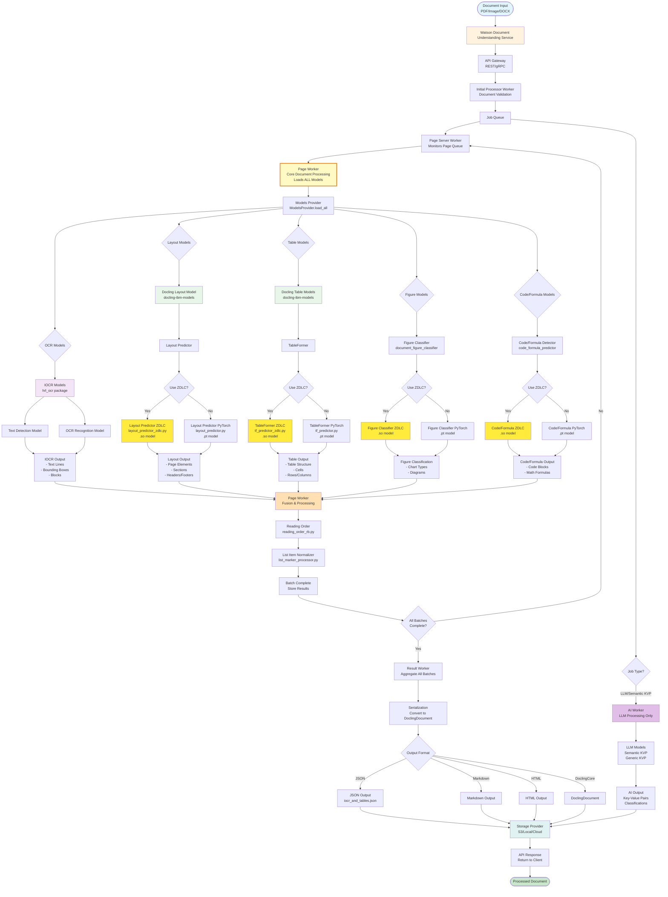

# Watson Document Understanding - End-to-End Document Processing Flow (CORRECTED)

## Mermaid Diagram



## Key Corrections

### Worker Responsibilities

#### Page Worker (Core Document Processing)
- **Loads ALL models**: OCR, Layout, Tables, Figures, Code/Formula
- **Processes document pages** with all AI models
- **Performs fusion** of all model outputs
- **Handles reading order** and list normalization
- **Stores batch results**

Code evidence:
```python
# page_worker.py line 68-69
ModelsProvider.setup(self.library_config)
ModelsProvider.load_all()  # Loads ALL models
```

#### AI Worker (LLM Processing Only)
- **Separate worker** for LLM/semantic tasks
- **Only loads LLM models**: Semantic KVP, Generic KVP
- **Handles**: Schema creation, classification, key-value extraction
- **Does NOT** handle OCR, layout, tables, or figures

Code evidence:
```python
# ai_worker.py line 91-96
ModelsProvider.get_semantic_kvp_model()
ModelsProvider.get_generic_kvp_model()
# Only LLM models, not OCR/layout/tables
```

### Processing Flow

1. **Document Input** → API Gateway → Initial Processor
2. **Initial Processor** validates and creates page batches
3. **Page Server** monitors queue and dispatches to Page Workers
4. **Page Worker**:
   - Loads ALL models (IOCR + Docling models)
   - Processes pages with OCR, layout, tables, figures, code detection
   - Fuses all outputs
   - Applies reading order and list normalization
   - Stores batch results
5. **Result Worker** (when all batches complete):
   - Aggregates all batch results
   - Serializes to final format
   - Stores in storage provider
6. **AI Worker** (separate path for LLM tasks):
   - Only for semantic KVP, classification, schema tasks
   - Does NOT process OCR/layout/tables

### ZDLC Integration

Your ZDLC predictors integrate in the **Page Worker** at these points:
- Layout Predictor ZDLC
- TableFormer ZDLC
- Figure Classifier ZDLC
- Code/Formula ZDLC

All run within the Page Worker's model loading and processing pipeline.

## Component Details

### Page Worker Architecture
```
Page Worker
├── ModelsProvider.load_all()
│   ├── IOCR Models (hrl_ocr)
│   │   ├── Text Detection
│   │   └── OCR Recognition
│   └── Docling Models (docling-ibm-models)
│       ├── Layout Predictor (PyTorch or ZDLC)
│       ├── TableFormer (PyTorch or ZDLC)
│       ├── Figure Classifier (PyTorch or ZDLC)
│       └── Code/Formula Detector (PyTorch or ZDLC)
├── Process Pages
├── Fusion Layer
├── Reading Order
├── List Normalization
└── Store Batch Results
```

### AI Worker Architecture (Separate)
```
AI Worker
├── ModelsProvider (LLM only)
│   ├── Semantic KVP Model
│   └── Generic KVP Model
├── Process LLM Tasks
│   ├── Schema Creation
│   ├── Classification
│   └── Key-Value Extraction
└── Store Results